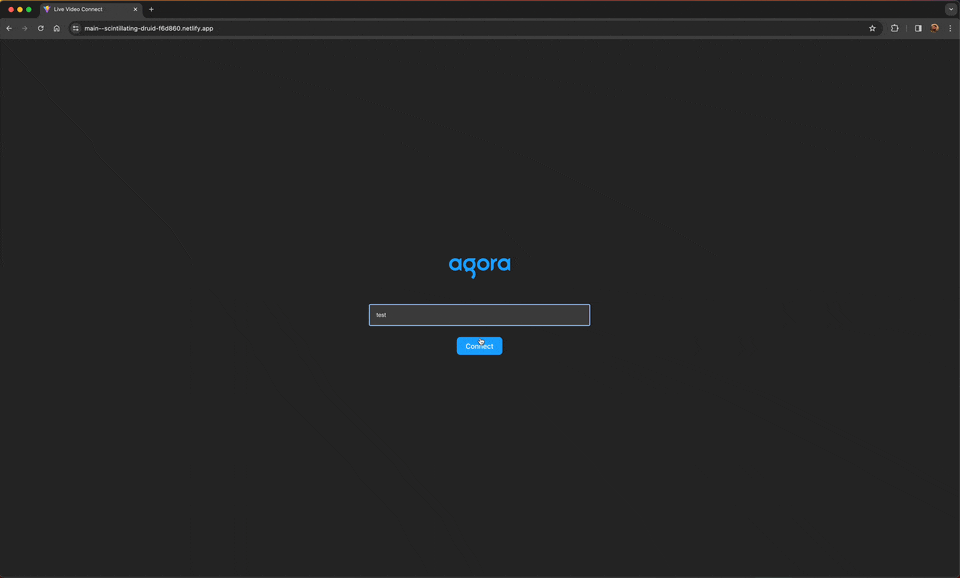

# live-video-react-app-dev
---

This demo app demonstrates how to use the Agora ReactJS SDK to create a simple live video web-app.


## Test on local host
1. Download the repo
2. Run ```npm install```
3. Run ```npm run dev```
> Note: This project uses Vite with `--host` to expose the device to the network

## Deployments
Demo: https://main--scintillating-druid-f6d860.netlify.app/
